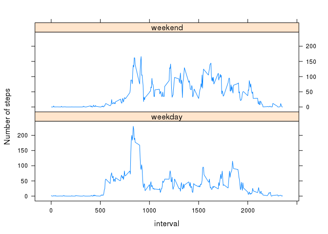

# Reproducible Research: Peer Assessment 1


## Loading and preprocessing the data

```r
sleep <- read.csv(file = "activity.csv")
sleep$dt <- as.Date(as.character(sleep$date), format="%Y-%m-%d")
```
## What is mean total number of steps taken per day?

```r
total <- aggregate(steps ~ dt , data = sleep , FUN = sum )
hist(total$steps)
```

 

Mean of total steps taken per day:

```r
mn <- mean(total$steps)
summary(mn)
```

```
##    Min. 1st Qu.  Median    Mean 3rd Qu.    Max. 
##   10770   10770   10770   10770   10770   10770
```

Median of total steps taken per day:

```r
md <- median(total$steps)
summary(md)
```

```
##    Min. 1st Qu.  Median    Mean 3rd Qu.    Max. 
##   10760   10760   10760   10760   10760   10760
```

## What is the average daily activity pattern?

```r
average <- aggregate(steps ~ interval , data = sleep , FUN = mean )
plot(average, type="n")
lines(average$interval, average$steps, type="l")
```

 

The 5-minute interval, on average across all the days in the dataset, that contains the maximum number of steps:

```r
average[which.max(average[,2]),1]
```

```
## [1] 835
```

## Imputing missing values
Number of rows with NA values:

```r
nrow(sleep[is.na(sleep$steps),])
```

```
## [1] 2304
```

Fill in the missing values using mean of the same 5 minutes interval:

```r
names(average) <- c("interval", "averageSteps")
newSleep <- merge(sleep, average, by="interval")
nai <- which(is.na(newSleep$steps))
newSleep$steps[nai] <- newSleep$averageSteps[nai]
```

The new total number of steps taken per day:

```r
newTotal <- aggregate(steps ~ dt , data = newSleep , FUN = sum )
hist(newTotal$steps)
```

 

Mean of new total steps taken per day:

```r
nmn <- mean(newTotal$steps)
summary(nmn)
```

```
##    Min. 1st Qu.  Median    Mean 3rd Qu.    Max. 
##   10770   10770   10770   10770   10770   10770
```

Median of new total steps taken per day:

```r
nmd <- median(newTotal$steps)
summary(nmd)
```

```
##    Min. 1st Qu.  Median    Mean 3rd Qu.    Max. 
##   10770   10770   10770   10770   10770   10770
```

## Are there differences in activity patterns between weekdays and weekends?

```r
newSleep$wd[weekdays(newSleep$dt) == "Sunday"] <- "weekend" 
newSleep$wd[weekdays(newSleep$dt) == "Saturday"] <- "weekend" 
newSleep$wd[is.na(newSleep$wd)] <- "weekday" 
newSleep$wd <- factor(newSleep$wd)

newAverage <- aggregate(newSleep$steps, by=list(newSleep$interval,newSleep$wd), FUN = mean )
names(newAverage) <- c("interval", "wd", "steps")

library(lattice)
xyplot(steps ~ interval | wd, data=newAverage, t="l", layout=c(1,2), ylab="Number of steps")
```

 
